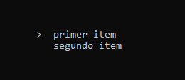

# Console Menu

## Description
`Console Menu` is a static library project that you can use in your C++ console applications. So you will give it more interactivity and make more interesting.



## Usage
For include the library, you can copy the `lib` directory or its contents into your project directory. Then use the `include` directive to call the `Menu.hpp` header file from your source code.

```
#include <iostream>
// include the library
#include "Menu.hpp"

int main(int argc, char *argv[])
{
    return 0;
}
```
On `src` directory, you can find some examples for implementation. Take a look there.

## Actions
Use the keyboard arrows to move the menu's cursor.

## Stay in touch

- Author - [Facundo Conci](https://www.linkedin.com/in/facundo-ignacio-conci-caceres/)